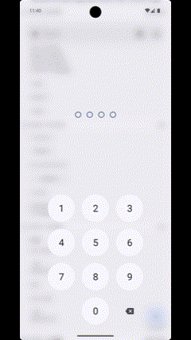
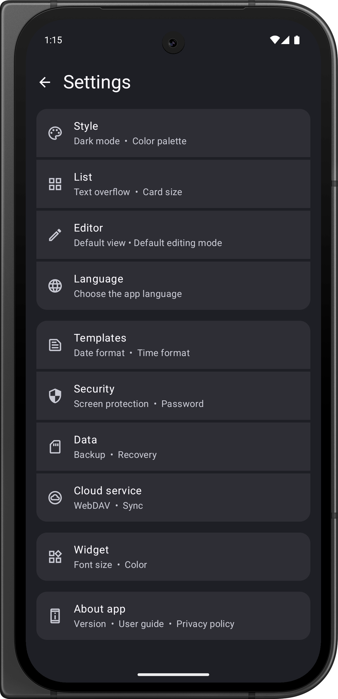

- [English](README.md)
- [Italiano](README.it.md)
- [简体中文](README.zh.md)
- [Türkçe](README.tr.md)

# OpenNote


OpenNote è un'app per Android moderna per la creazione di note, sviluppata interamente con Compose.

[](https://play.google.com/store/apps/details?id=com.yangdai.opennote)
[](https://apt.izzysoft.de/fdroid/index/apk/com.yangdai.opennote)
[](https://github.com/YangDai2003/OpenNote-Compose/releases)

## 📃 Caratteristiche

### Caratteristiche principali:
- **Crea, modifica ed elimina note:** L'utente può facilmente creare, modificare e rimuovere le note.
- **Crea, modifica ed elimina cartelle:** Organizza le note in modo efficace utilizzando le funzionalità di gestione delle cartelle.
- **Ordinamento e filtraggio:** Ordina e filtra facilmente note e cartelle.
- **Sposta note:** Sposta facilmente le note tra cartelle diverse per una migliore organizzazione.
- **Cestino:** Sposta in modo sicuro le note nel cestino per l'archiviazione temporanea prima della cancellazione definitiva.

### Funzionalità avanzate:
- **Struttura contestuale**: Genera automaticamente un **albero delle note** basato sulla semantica dei titoli, consentendo di cliccare e scorrere fino alla sezione corrispondente. Visualizza **il conteggio delle parole, il conteggio delle righe e altro ancora** a colpo d'occhio.
- **Trova e sostituisci**: La nota è troppo lunga e non riesci a trovare l'ubicazione di un determinato termine? Vuoi modificarla in blocco invece che poco alla volta? Prova questa funzione.
- **Modelli di note:** Inserisci le note come modelli, con formattazione automatica di data e ora.
- **Sintassi Markdown:** Supporto completo per la sintassi CommonMark e GitHub Flavored Markdown (GFM) per opzioni di formattazione avanzate.
- **Supporto per formule LaTeX:** Incorpora la sintassi matematica LaTeX per la rappresentazione delle equazioni matematiche.
- **Supporto per diagrammi Mermaid:** Supporta la sintassi Mermaid per la creazione di diagrammi e diagrammi di flusso.

### Modalità di scrittura:
- **Modalità Lite:** Fornisce la sintassi Markdown di base con una visualizzazione WYSIWYG (What You See Is What You Get, ciò che vedi è ciò che ottieni).
- **Modalità Standard:** Offre pieno supporto alla sintassi Markdown con rendering preciso, separando le aree di modifica e lettura.

### Caratteristiche aggiuntive:
- **Lettura testo condiviso** L'app può ricevere direttamente il testo condiviso da altre applicazioni e creare una nuova nota con esso.
- **Apertura nativa dei documenti:** L'app può essere selezionata come gestore predefinito per vari tipi di documenti di testo (come .txt, .md e .html), consentendo di aprirli direttamente e convertirli successivamente in note..
- **Opzioni di esportazione:** Le note possono essere esportate in vari formati, tra cui TXT, Markdown, PDF e HTML, per una condivisione e un utilizzo più versatili.
- **Material 3 Design:** Rispetta le linee guida Material Design 3 per un'interfaccia utente moderna e coerente.
- **Supporto completo per mouse e tastiere:** L'app è stata accuratamente adattata per garantire un'interazione perfetta con mouse e tastiere fisiche esterne, garantendo un ambiente altamente produttivo.
- **Design responsivo:** Ottimizzato per varie dimensioni dello schermo e orientamenti dei dispositivi, garantisce un'esperienza eccellente su telefoni, tablet, dispositivi pieghevoli e persino dispositivi ChromeOS.

## 🖼️ Screenshot

<div style="overflow-x: auto; white-space: nowrap;">







</div>

## 🌎 Traduzioni

L'app è attualmente disponibile in cinese, inglese, italiano, tedesco e turco.

## 💡 Come utilizzare OpenNote con Markdown, LaTeX Math e diagrammi Mermaid?

Per ulteriori informazioni su come utilizzare OpenNote con Markdown, LaTeX Math e Mermaid Diagrams, consultare
la [Guida](Guide.md).

## 🔎 Info tecniche

- **Linguaggio di programmazione**: Kotlin
- **Software di progettazione**: Gradle con Kotlin DSL
- **Versione Android**: L'app è sviluppata per la versione 35 dell'SDK Android ed è compatibile con i dispositivi
  che utilizzano la versione 29 o successive dell'SDK Android.
- **Versione di Kotlin**: 2.1.20.
- **Versione di Java**: JVM Target 17.

## 🛠️ Architettura

- **MVVM (Model-View-ViewModel)**: Separates the user interface logic from the business logic,
  providing a clear separation of concerns.
- **Clean Architecture**: Emphasizes separation of concerns and layers of abstraction, making the
  application more modular, scalable, and maintainable.

## 📚 Librerie e Framework

- **Compose**: Un kit di strumenti moderno per la creazione di interfacce utente native Android.
- **Hilt**: Una libreria di dependency injection per Android.
- **KSP (Kotlin Symbol Processing API)**: Migliora la compilazione Kotlin con l'elaborazione di metadati aggiuntivi.
- **Room**: Una libreria di persistenza che fornisce un livello di astrazione su SQLite.
- **Compose Navigation**: Semplifica l'implementazione della navigazione tra le schermate.
- **Material Icons**:Fornisce icone Material Design per elementi visivi coerenti.
- **CommonMark**: Per l'analisi e il rendering del markdown.

## 🔐 Privacy Policy e autorizzazioni

È possibile trovare l'informativa sulla privacy e le autorizzazioni richieste nell'[Informativa sulla privacy](PRIVACY_POLICY.it.md).

## 📦 Installazione

Per compilare ed eseguire quest'applicazione, è necessario installare l'ultima versione di Android Studio.
Quindi, clonare questo repository da GitHub e aprirlo in Android Studio.

```bash
git clone https://github.com/YangDai2003/OpenNote.git
```

In Android Studio, selezionare `Run > Run 'app'` per avviare l'app.

## 🎈 Contribuzione

Qualsiasi forma di contributo è ben accetta! Se trovi un bug o vuoi richiedere nuove funzionalità, apri un'issue.
Se desideri contribuire direttamente al codice di questo progetto, puoi effettuare una pull request.

## 🔗 Referimenti

- [MaskAnim](https://github.com/setruth/MaskAnim): Implementazione della funzione del cambio di tema tramite animazione maschera.