- [English](README.md)
- [简体中文](README.zh.md)
- [Türkçe](README.tr.md)

# OpenNote


OpenNote is a modern Android note-taking application built entirely with Compose.  
It is developed using Kotlin (Compose) and follows the MVVM (Model-View-ViewModel) architecture
pattern along with Clean Architecture principles.

<a href="https://play.google.com/store/apps/details?id=com.yangdai.opennote">
      
</a>

<a href="https://github.com/YangDai2003/OpenNote-Compose/releases">
      
</a>

## Features

### Core Features:
- **Create, Edit, and Delete Notes:** Users can easily create, modify, and remove notes.
- **Create, Edit, and Delete Folders:** Organize notes effectively using folder management capabilities.
- **Sorting and Filtering:** Effortlessly sort and filter notes and folders based on various criteria.
- **Move Notes:** Seamlessly move notes between different folders for improved organization.
- **Trash Bin:** Securely move notes to a trash bin for temporary storage before permanent deletion.

### Advanced Capabilities:
- **Note Templates:** Insert notes from the "Templates" folder as templates, with automatic date and time formatting.
- **Local Image Support:** Directly import local images from the device into notes, with in-app preview.
- **OCR Text Recognition:** Utilize ML Kit and CameraX for Optical Character Recognition (OCR) directly from images.
- **Markdown Support:** Comprehensive support for CommonMark and GitHub Flavored Markdown (GFM) syntax for rich formatting options.
- **LaTeX Math Support:** Incorporates LaTeX Math syntax for rendering mathematical equations.
- **Mermaid Support:** Supports Mermaid syntax for creating diagrams and flowcharts.

### Editing Modes:
- **Lite Mode:** Provides basic Markdown syntax with a WYSIWYG (What You See Is What You Get) display.
- **Standard Mode:** Offers full Markdown syntax support with precise rendering, separating the editing and reading areas.

### Additional Features:
- **Accept Shared Text:** The app can directly receive text shared from other applications and create a new note with it.
- **Directly Open Documents:** The app can be selected as handler for various text document types (such as .txt, .md, and .html), allowing them to be opened directly and converted into notes.
- **Export Options:** Notes can be exported in various formats, including TXT, Markdown, PDF, and HTML, for versatile sharing and usage.
- **Material 3 Design:** Adheres to Material Design 3 guidelines for a modern and cohesive user interface.
- **Comprehensive Mouse and Keyboard Support:** The app has been thoroughly adapted for seamless interaction with mice and external physical keyboards, delivering a highly productive environment.
- **Responsive Design:** Optimized for various screen sizes and device orientations, ensuring a great experience on phones, tablets, foldables and even ChromeOS devices.

## Screenshots

<div style="overflow-x: auto; white-space: nowrap;">

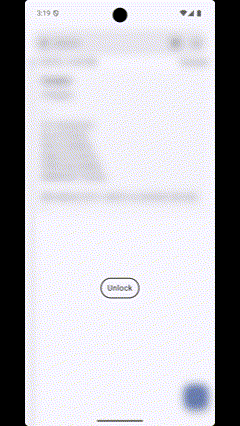
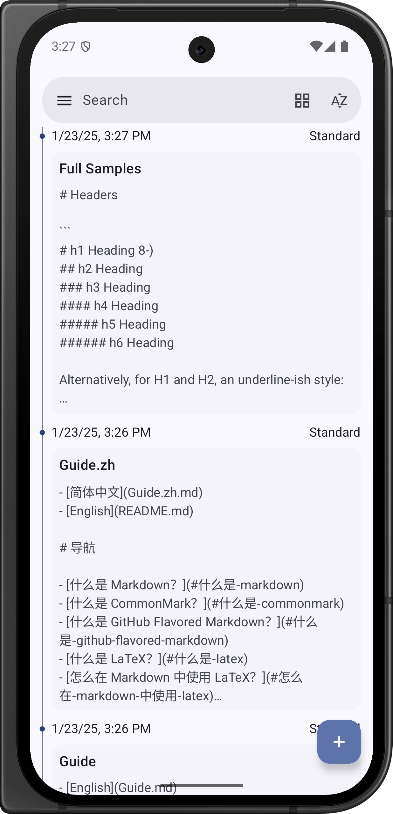
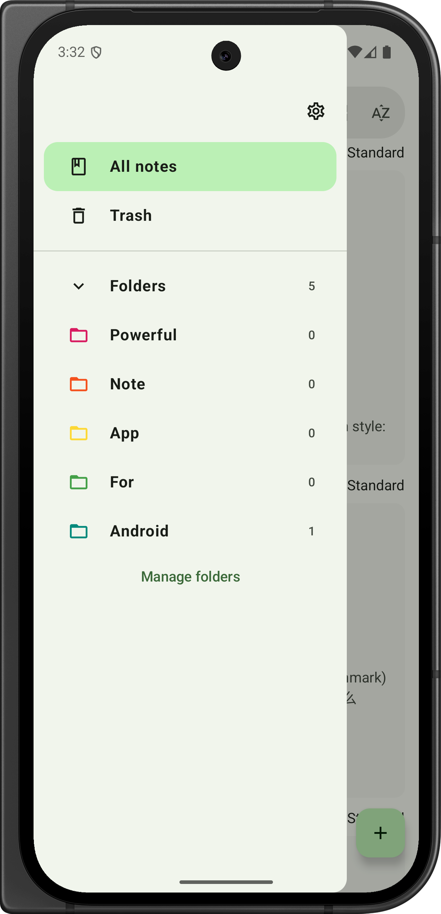
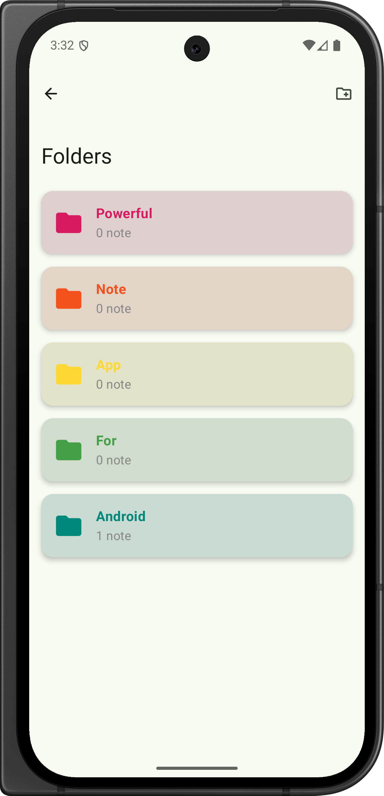
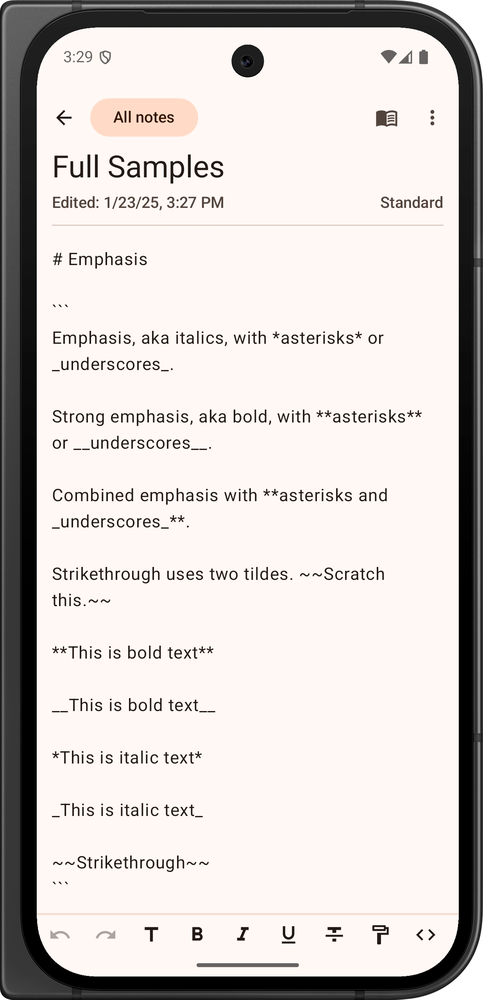
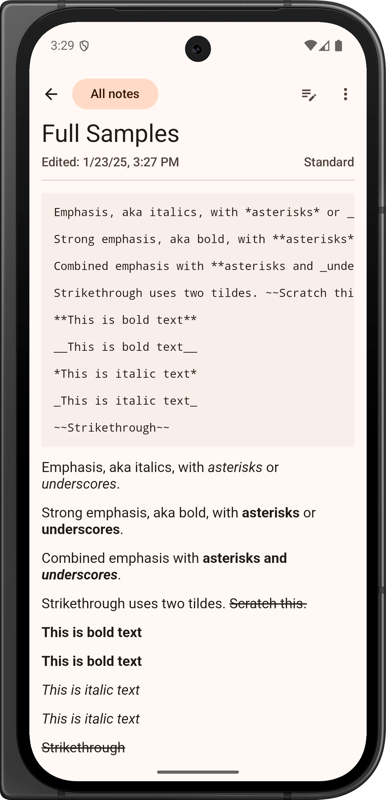
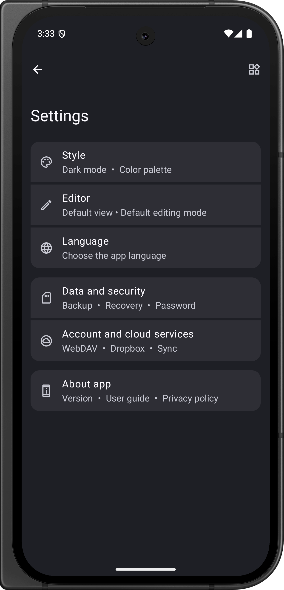
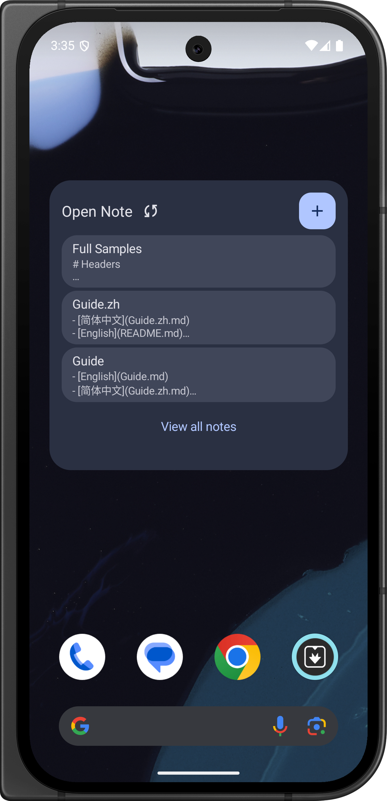


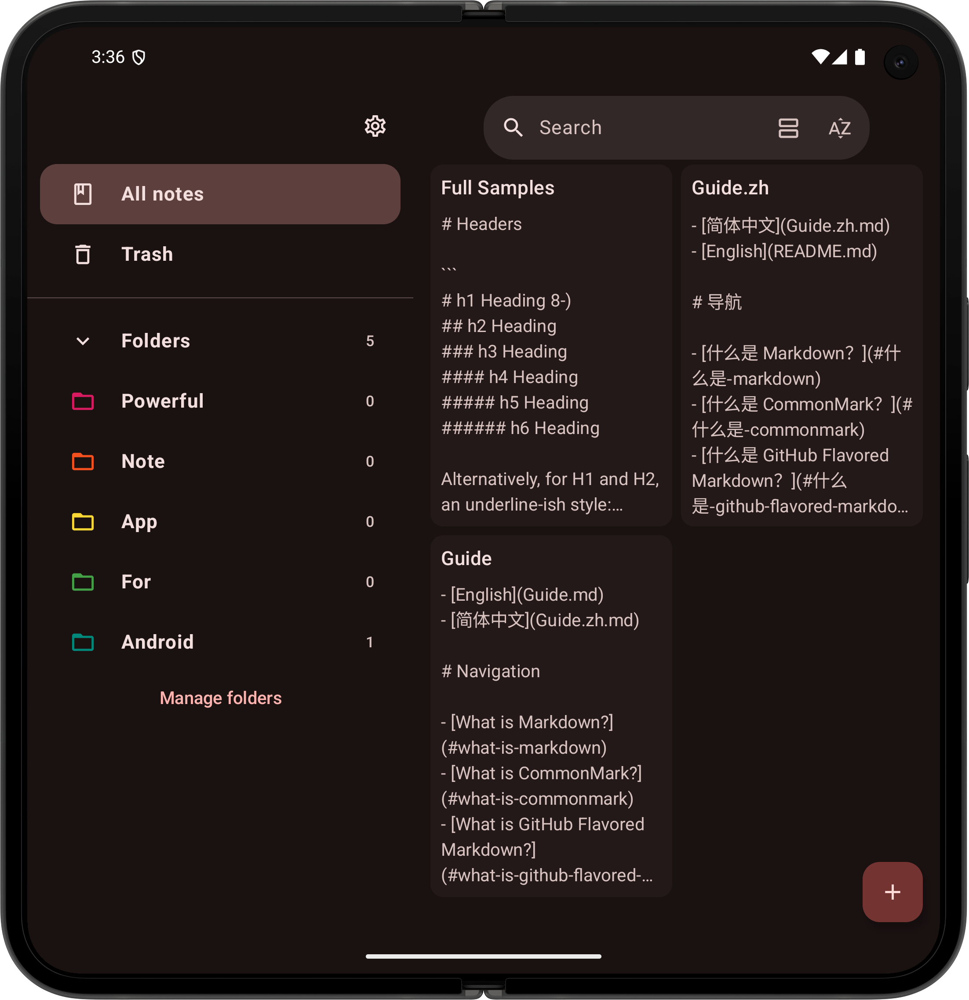
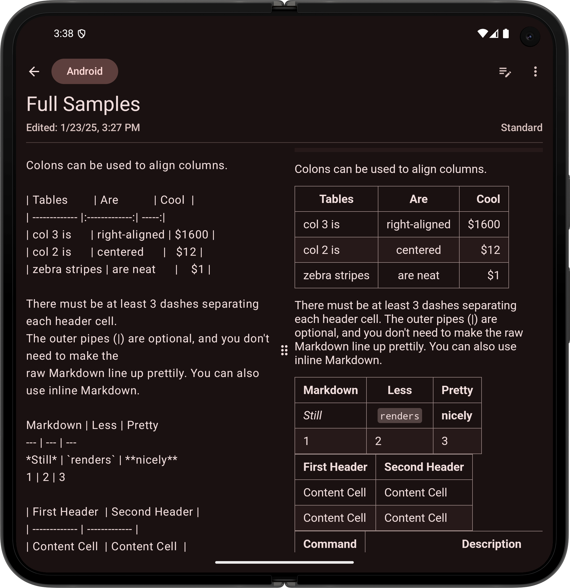
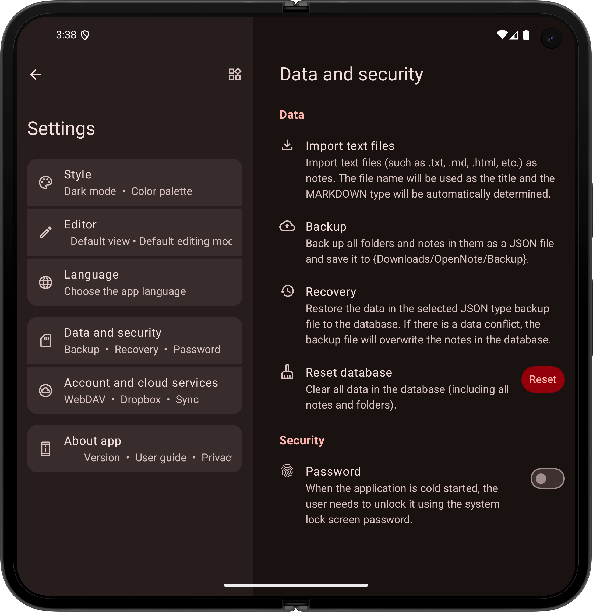

</div>

## How to Use OpenNote with Markdown, LaTeX Math, and Mermaid Diagrams?

You can know more about how to use OpenNote with Markdown, LaTeX Math, and Mermaid Diagrams in
the [Guide](Guide.md).

## Technical Details

- **Programming Languages**: Kotlin
- **Build Tool**: Gradle with Kotlin DSL
- **Android Version**: The application targets Android SDK version 35 and is compatible with devices
  running Android SDK version 29 and above.
- **Kotlin Version**: The application uses Kotlin version 2.1.10.
- **Java Version**: The application uses Java version 17.

## Architecture

- **MVVM (Model-View-ViewModel)**: Separates the user interface logic from the business logic,
  providing a clear separation of concerns.
- **Clean Architecture**: Emphasizes separation of concerns and layers of abstraction, making the
  application more modular, scalable, and maintainable.

## Libraries and Frameworks

- **Compose**: A modern toolkit for building native Android UI.
- **Hilt**: A dependency injection library for Android.
- **KSP (Kotlin Symbol Processing API)**: Enhances Kotlin compilation with additional metadata
  processing.
- **Room**: A persistence library providing an abstraction layer over SQLite.
- **Compose Navigation**: Simplifies the implementation of navigation between screens.
- **Material Icons**: Provides Material Design icons for consistent visual elements.
- **ML Kit**: Utilized for OCR text recognition.
- **CameraX**: Used for custom camera functionality.

## Privacy Policy and Required Permissions

You can find the Privacy Policy and Required Permissions in the [Privacy Policy](PRIVACY_POLICY.md).

## Installation

To build and run this application, you need to install the latest version of Android Studio. Then,
you can clone this repository from GitHub and open it in Android Studio.

```bash
git clone https://github.com/YangDai2003/OpenNote.git
```

In Android Studio, select `Run > Run 'app'` to start the application.

## Contribution

Any form of contribution is welcome! If you find a bug or have a new feature request, please create
an issue. If you want to contribute code directly to this project, you can create a pull request.

## References

- [MaskAnim](https://github.com/setruth/MaskAnim): Implementation of the theme switching function
  using mask animation.