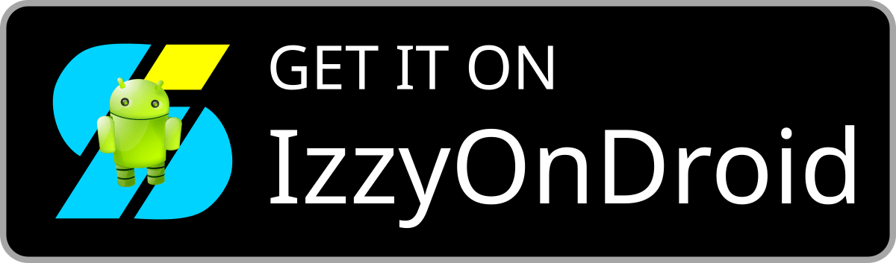

- [Türkçe](README.tr.md)
- [English](README.md)
- [简体中文](README.zh.md)
  
# OpenNote


OpenNote, tamamen Jetpack Compose kullanılarak geliştirilmiş modern bir Android not alma uygulamasıdır.

<div style="display: flex; justify-content: center; align-items: center;">
    <a href="https://play.google.com/store/apps/details?id=com.yangdai.opennote" style="margin: 0 10px;">
        
    </a>
    <a href="https://github.com/YangDai2003/OpenNote-Compose/releases" style="margin: 0 10px;">
        
    </a>
    <a href="https://apt.izzysoft.de/fdroid/index/apk/com.yangdai.opennote" style="margin: 0 10px;">
        
    </a>
</div>

## Özellikler

### Temel Özellikler:
- **Not Oluşturma, Düzenleme ve Silme:** Kullanıcılar kolayca not oluşturabilir, düzenleyebilir ve silebilir.
- **Klasör Oluşturma, Düzenleme ve Silme:** Notları etkili bir şekilde organize etmek için klasör yönetimi sunar.
- **Sıralama ve Filtreleme:** Notları ve klasörleri farklı kriterlere göre sıralayıp filtreleme imkanı sağlar.
- **Notları Taşıma:** Notları farklı klasörler arasında sorunsuz bir şekilde taşımayı destekler.
- **Çöp Kutusu:** Notları kalıcı olarak silmeden önce çöp kutusuna taşıma özelliği sunar.

### Gelişmiş Yetenekler:
- **Bul ve değiştir**: Not çok uzun ve belirli bir metnin yerini bulamıyor musunuz? Notu toplu olarak değiştirmek istiyorsunuz ancak tek tek düzenlemek çok can sıkıcı mı? Bu özelliği deneyin.
- **Not Şablonları:** "Templates" klasöründeki notları şablon olarak ekleyebilir, tarih ve saat formatlamasını otomatik olarak uygular.
- **Yerel Görsel Desteği:** Cihazdan doğrudan notlara görsel ekleyebilir ve uygulama içinde önizleme yapabilirsiniz.
- **Markdown Desteği:** CommonMark ve GitHub Flavored Markdown (GFM) sözdizimini destekleyerek zengin biçimlendirme seçenekleri sunar.
- **LaTeX Matematik Desteği:** Matematiksel denklemleri oluşturmak için LaTeX sözdizimini destekler.
- **Mermaid Desteği:** Diyagramlar ve akış şemaları oluşturmak için Mermaid sözdizimini destekler.

### Düzenleme Modları:
- **Lite Modu:** Temel Markdown sözdizimi ile WYSIWYG (What You See Is What You Get) görüntüleme sunar.
- **Standart Mod:** Tam Markdown sözdizimi desteği ile düzenleme ve görüntüleme alanlarını ayrı sunar.

### Ek Özellikler:
- **Paylaşılan Metni Kabul Etme:** Başka uygulamalardan paylaşılan metni doğrudan alarak yeni bir not oluşturabilir.
- **Belgeleri Doğrudan Açma:** TXT, MD ve HTML gibi metin belgelerini doğrudan açarak not olarak dönüştürebilir.
- **Dışa Aktarma Seçenekleri:** Notlar, TXT, Markdown, PDF ve HTML formatlarında dışa aktarılabilir.
- **Material 3 Tasarımı:** Modern ve tutarlı bir kullanıcı arayüzü için Material Design 3 yönergelerine uyar.
- **Fare ve Klavye Desteği:** Harici fare ve klavyelerle eksiksiz bir uyumluluk sunarak üretkenliği artırır.
- **Duyarlı Tasarım:** Telefonlar, tabletler, katlanabilir cihazlar ve ChromeOS cihazları için optimize edilmiştir.

## Ekran Görüntüleri

<div style="overflow-x: auto; white-space: nowrap;">


</div>

## OpenNote'u Markdown, LaTeX Matematik ve Mermaid Diyagramları ile Kullanma

OpenNote'un Markdown, LaTeX Matematik ve Mermaid Diyagramları ile nasıl kullanılacağını öğrenmek için  
[Rehber](Guide.md) dosyasına göz atabilirsiniz.

## Teknik Detaylar

- **Programlama Dili**: Kotlin
- **Derleme Aracı**: Gradle (Kotlin DSL)
- **Android Sürümü**: Uygulama Android SDK 35 sürümünü hedefler ve Android SDK 29 ve üzeri cihazlarla uyumludur.
- **Kotlin Sürümü**: 2.1.10
- **Java Sürümü**: Java 17

## Mimari

- **MVVM (Model-View-ViewModel)**: Kullanıcı arayüzü mantığını iş mantığından ayırarak net bir yapı sunar.
- **Temiz Mimari (Clean Architecture)**: Modüler, ölçeklenebilir ve sürdürülebilir bir yapı için katmanlı bir ayrım uygular.

## Kütüphaneler ve Çatılar

- **Compose**: Modern, yerel Android kullanıcı arayüzleri oluşturmak için kullanılan bir araç takımı.
- **Hilt**: Android için bağımlılık enjeksiyonu sağlayan bir kütüphane.
- **KSP (Kotlin Symbol Processing API)**: Kotlin derleme sürecini geliştiren meta veri işleme aracı.
- **Room**: SQLite üzerinde soyutlama katmanı sağlayan bir kalıcılık (veritabanı) kütüphanesi.
- **Compose Navigation**: Ekranlar arasında gezinmeyi kolaylaştırır.
- **Material Icons**: Tutarlı görseller için Material Design simgelerini içerir.
- **CommonMark**: Markdown ayrıştırma ve işleme için.

## Gizlilik Politikası ve Gerekli İzinler

Gizlilik Politikası ve uygulamanın ihtiyaç duyduğu izinler hakkında bilgi almak için  
[Gizlilik Politikası](PRIVACY_POLICY.md) sayfasına göz atabilirsiniz.

## Kurulum

Bu uygulamayı derleyip çalıştırmak için en güncel Android Studio sürümünü yüklemeniz gerekir.  
Daha sonra GitHub üzerindeki bu projeyi klonlayarak Android Studio'da açabilirsiniz.

```bash
git clone https://github.com/YangDai2003/OpenNote.git
```

Android Studio'da, uygulamayı başlatmak için Çalıştır > 'app' Çalıştır seçeneğini seçin.

## Katkı

Her türlü katkıya açığız! Eğer bir hata bulursanız veya yeni bir özellik talebiniz varsa, lütfen bir 
issue oluşturun. Bu projeye doğrudan kod katkısında bulunmak istiyorsanız, bir pull request 
oluşturabilirsiniz.

## Referanslar

- [MaskAnim](https://github.com/setruth/MaskAnim): Tema değiştirme işlevinin maske animasyonu 
  kullanılarak uygulanması.
