- [简体中文](README.zh.md)
- [English](README.md)

# OpenNote


OpenNote是一款完全使用Compose构建的现代化Android记事本应用程序。
它使用Gradle和Kotlin DSL进行项目构建和依赖管理, 采用MVVM架构。

<a href="https://play.google.com/store/apps/details?id=com.yangdai.opennote">
      
</a>

<a href="https://github.com/YangDai2003/OpenNote-Compose/releases">
      
</a>

## 如何使用 Markdown, LaTeX Math 和 Mermaid 图表的语法在 OpenNote 中编写文档？

您可以在[指南](Guide.zh.md)中了解有关如何使用 Markdown，LaTeX Math 和 Mermaid 图表的语法在 OpenNote
中编写文档的更多信息。

## 功能

- **创建、编辑和删除笔记**：用户可以轻松创建、编辑和删除笔记。
- **创建、编辑和删除文件夹**：使用文件夹管理功能有效地组织笔记。
- **排序和过滤**：根据各种条件轻松排序和过滤笔记和文件夹。
- **移动笔记**：在不同文件夹之间无缝移动笔记以更好地组织。
- **垃圾箱**：将笔记安全地移至垃圾箱，以便在永久删除之前临时存储。
- **OCR 文本识别**：利用 ML Kit 和 CameraX 直接从图像进行光学字符识别 (OCR)。
- **Markdown 支持**：支持 CommonMark 和 GitHub Flavored Markdown (GFM) 语法，以实现多种格式选项。
- **LaTeX Math 支持**：支持 LaTeX Math 语法，用于数学方程。
- **Mermaid 支持**：支持 Mermaid 语法，用于创建图表和流程图。
- **富文本模式**：通过基本的富文本编辑功能提供简化的书写体验。
- **导出选项**：笔记可以以各种格式导出，包括 TXT、MD (Markdown) 和 HTML，以实现多种共享和使用。
- **Material 3 Design**：遵循 Material Design 指南，打造现代且具有凝聚力的用户界面。
- **响应式设计**：针对不同屏幕尺寸和方向的设备进行了优化。

## 屏幕截图

<div style="overflow-x: auto; white-space: nowrap;">

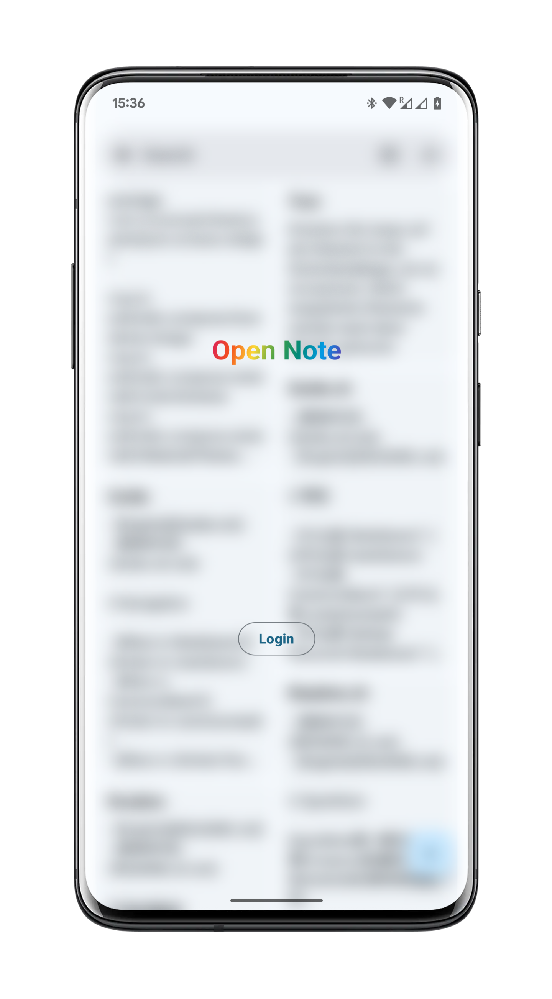
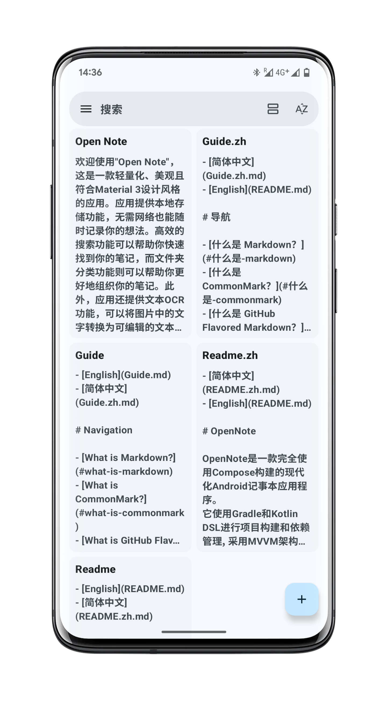
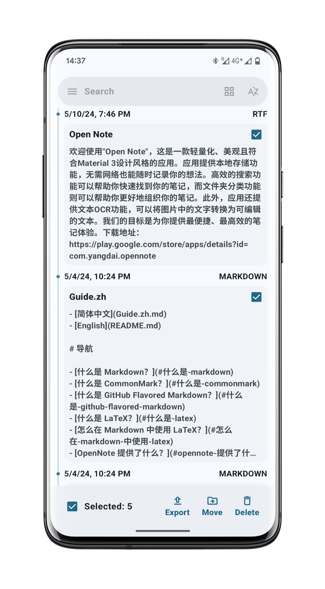
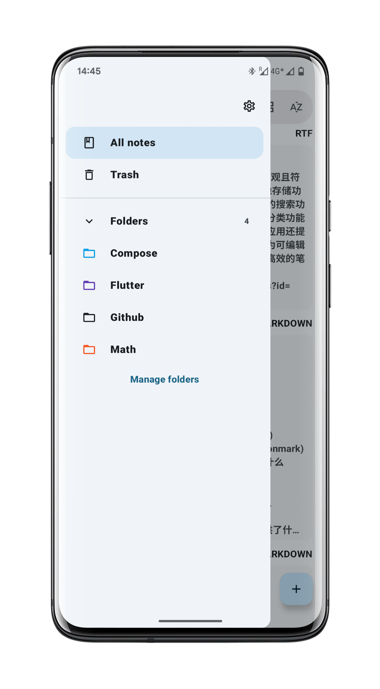
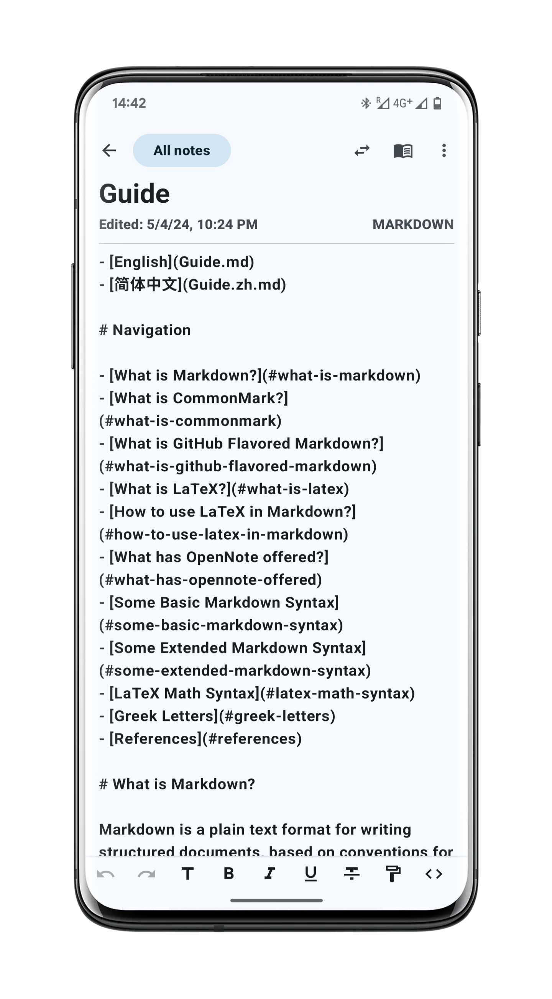
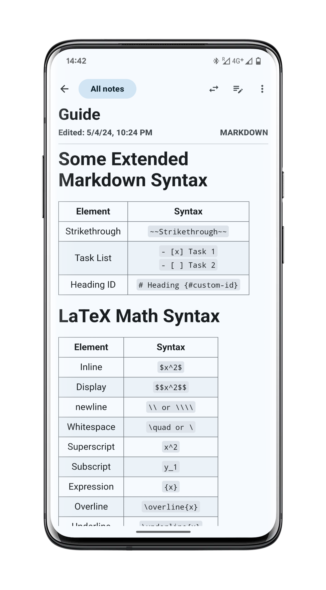
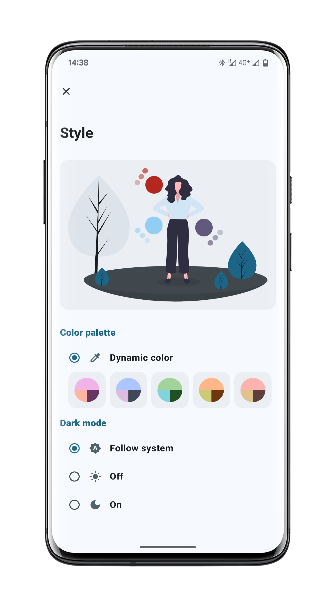
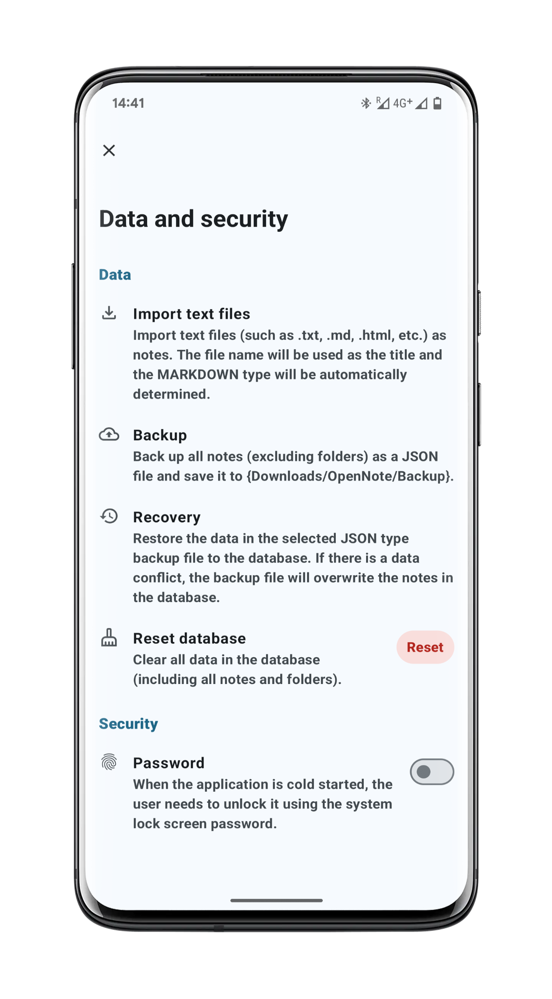
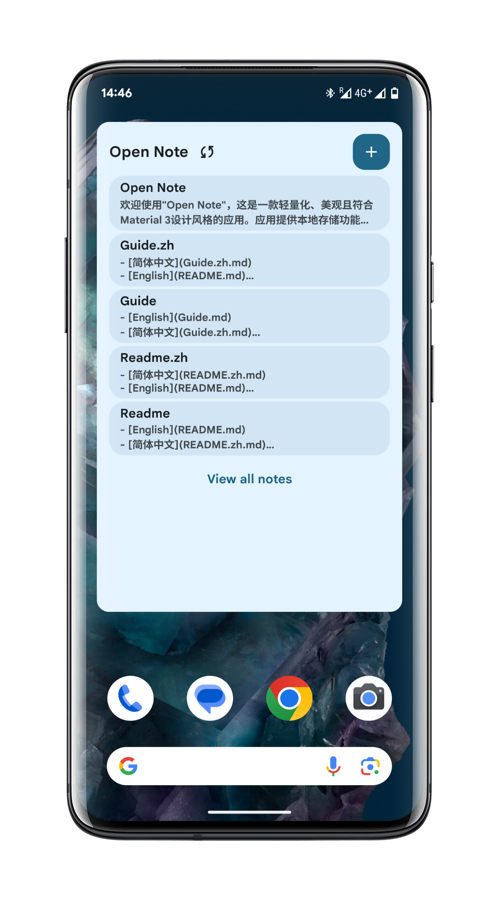

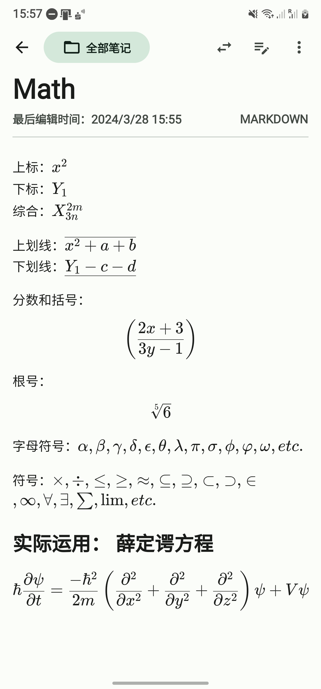
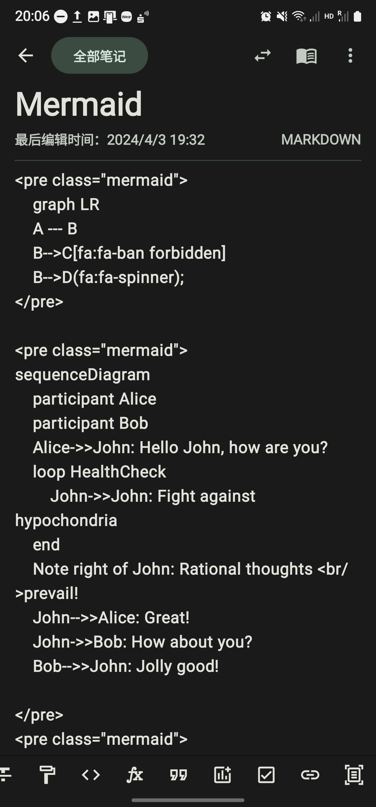

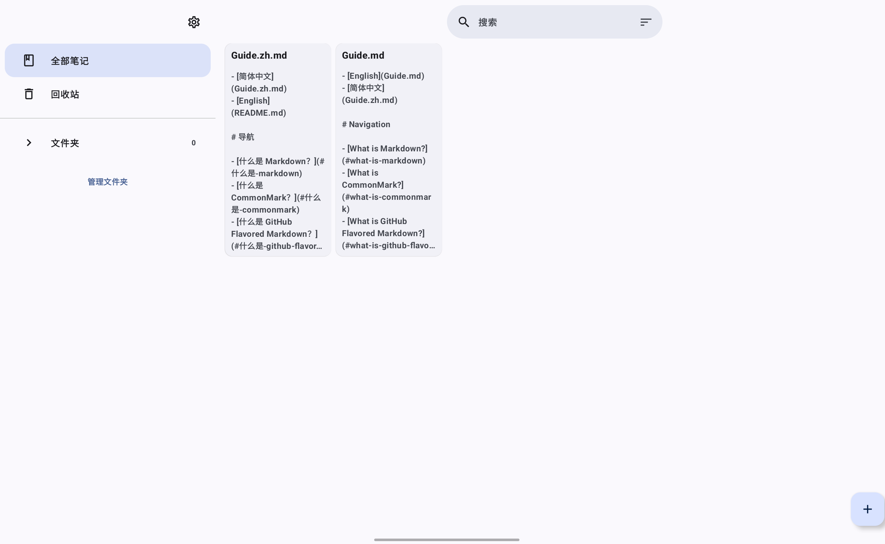


</div>

## 技术细节

- **编程语言**：Kotlin
- **构建工具**：Gradle和Kotlin DSL
- **Android版本**：应用程序目标为Android SDK版本34，并且与运行Android SDK版本29及以上的设备兼容。
- **Kotlin版本**：应用程序使用Kotlin版本2.0.0。
- **Java版本**：应用程序使用Java版本17。

## 架构

- **MVVM（模型-视图-视图模型）**：将用户界面逻辑与业务逻辑分开，提供清晰的关注点分离。
- **干净架构**：强调关注点和抽象层的分离，使应用程序更加模块化、可扩展和可维护。

## 库和框架

- **Compose**：用于构建本机 Android UI 的现代化工具包。
- **Hilt**：Android 的依赖注入库。
- **KSP（Kotlin 符号处理 API）**：通过额外的元数据处理增强 Kotlin 编译。
- **Room**：一个持久性库，提供 SQLite 上的抽象层。
- **Compose Navigation**：简化应用程序中不同屏幕间导航的实现。
- **Material Icons**：提供材质设计图标以实现一致的视觉元素。
- **ML Kit**：用于 OCR 文本识别。
- **CameraX**：用于自定义相机功能。

## 隐私政策和所需权限

您可以在[隐私政策](PRIVACY_POLICY.md)中找到隐私政策和所需权限。

## 安装

要构建和运行此应用程序，您需要安装最新版本的Android Studio。然后，您可以从GitHub克隆此仓库并在Android
Studio中打开它。

```bash
git clone https://github.com/YangDai2003/OpenNote.git
```

在Android Studio中，选择`Run > Run 'app'`来启动应用程序。

## 贡献

欢迎任何形式的贡献！如果您发现错误或有新的功能请求，请创建问题。如果您想直接向此项目贡献代码，您可以创建拉取请求。

## 参考

- [MaskAnim](https://github.com/setruth/MaskAnim)：用于使用遮罩动画来切换主题功能的实现。

## 待办

- [] 添加对 WebDAV 和 Dropbox 的支持
- [] 添加更多偏好设置